# DistributedSharedWhiteBoard
## System Architecture
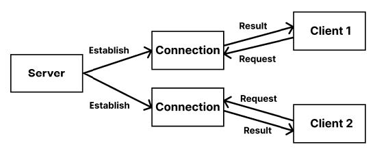

*Thread-per-connection client-server architecture*
## Server
The server is implemented using thread-per-connection architecture. When the server is launched, the servers’ GUI shows up, and it will wait for the incoming sockets from the clients, then establish a
connection for each client.
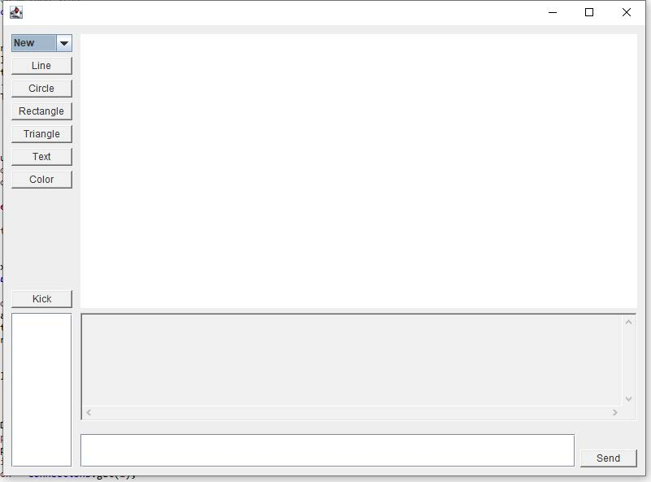
*Server GUI*
## Client
The client creates a socket trying to connect with the server. The client’s GUI includes everything the Server’s GUI has except the panel shows the current connected users and the ‘Kick’ button.
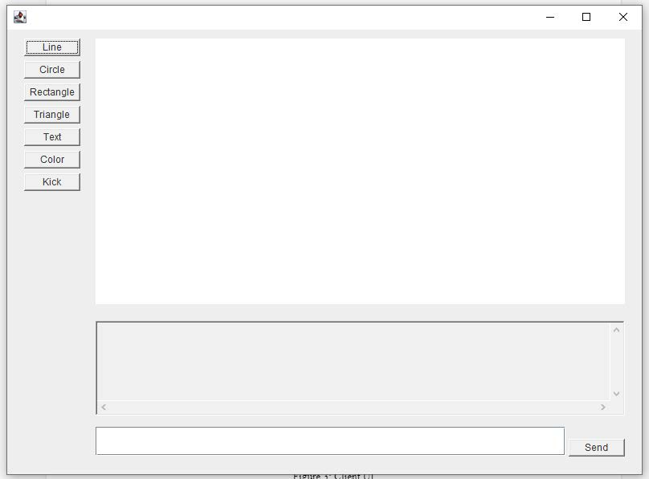

*Client GUI*
## Communication Protocols
In terms of the protocol choice, I chose TCP because of its reliability. It isn't easy to establish a reliable connection by using UDP because it has to implement a separate infrastructure.
## Message Formats
I used JSON to transmit data between server and clients. JSON is a formal and popular message exchange protocol. Besides, compared with XML, JSON requires fewer resources.
## Design Diagrams
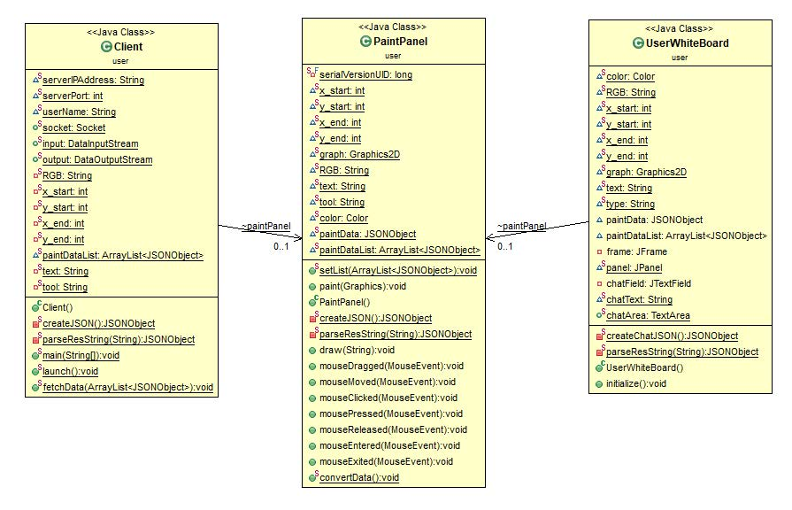

*User’s classes*

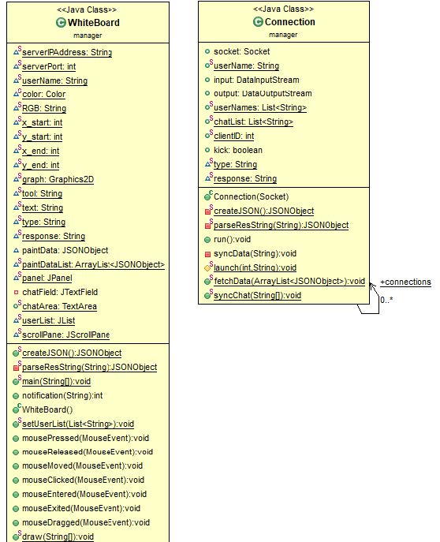

*Manager’s classes*
## Implementation Details
- The server is launched by inputting <serverIPAddress> <serverPort> and manager name in the terminal.
- The client is launched by inputting <serverIPAddress> <serverPort> and username in the terminal. The username must be unique, otherwise the connection will be enforced to shut down.

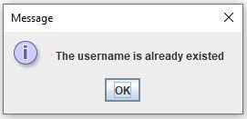

*A pop up window notifies the client that the username is duplicate*
- If the username is available, the manager will receive a message to determine whether to allow the user to share the dashboard. If the application is rejected, the user will be notified.

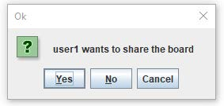

*A pop up window notifies the manager “user1” wants to join*

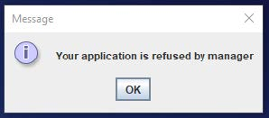

*A pop up window notifies the user the application is rejected*
- The shape, line, rectangle, circle, triangle are drawable.
- The manager and users can type text anywhere inside the white board.
- A lot of colors can be chosen and applied in shapes drawing and text typing.

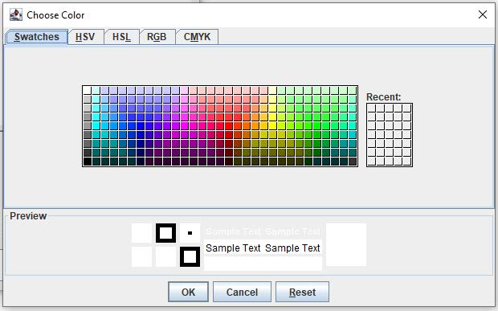

- The drawing and text typing is shareable among the manager and clients in real time without any delays.
- Chat window is implemented. The manager and users can talk in the chat window.

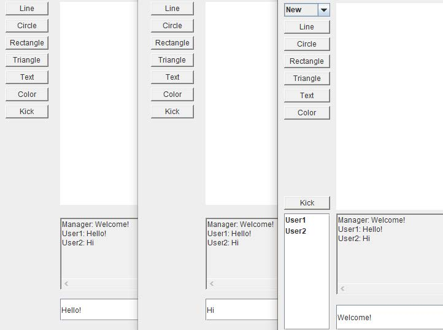

*Chat window*

- The manager is able to see the user’s list and kick the selected user.

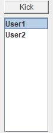

*Kick a selected user*

- When a user is disconnected, the manager will be notified.

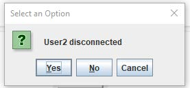

A pop up window notifies the user2 is disconnected.

- When the server is closed, all the users will be notified.

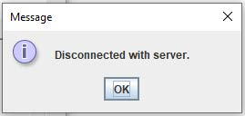

*All the users will be notified.*
